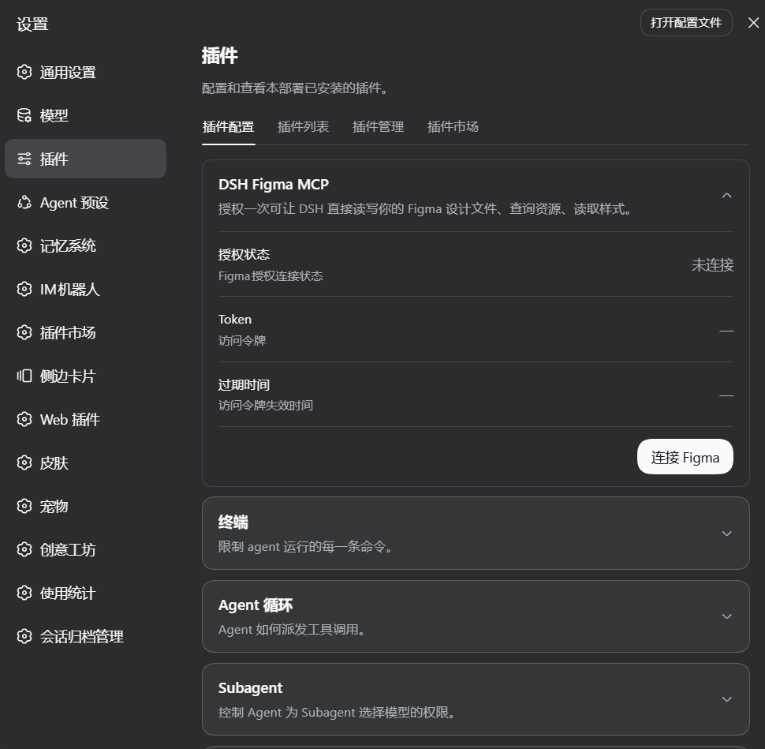
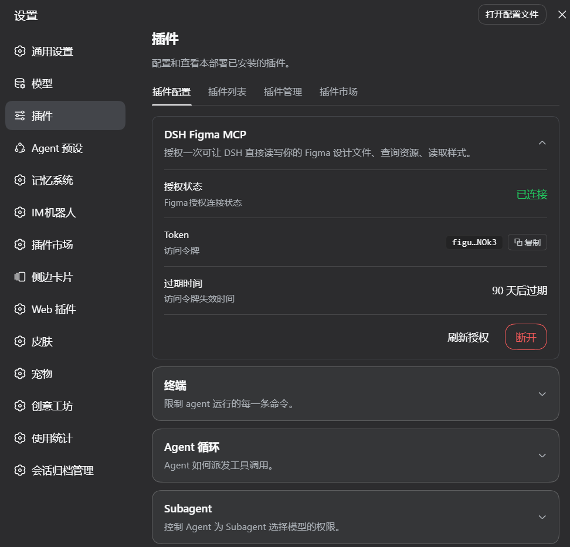
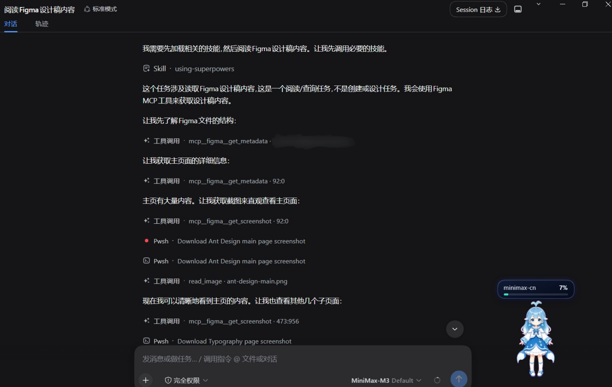

# dsh-figma-mcp

<div align="center">

<a href="LICENSE"></a>
<a href="#"></a>
<a href="#"></a>

</div>

[English](./README.en.md)

DSH 的 Figma MCP 一键连接插件。

## 前置要求

DSH ≥ 0.1.2-rc.1（web profile）和 Figma 账号。

## 安装

### 从 npm 安装

```bash
dsh plugin --profile web add dsh-figma-mcp
```

### 从 GitHub 安装

```bash
dsh plugin --profile web add github:lubanqihao9875/dsh-figma-mcp
```

### 本地开发

先克隆仓库并进入目录：

```bash
git clone https://github.com/lubanqihao9875/dsh-figma-mcp.git
cd dsh-figma-mcp
```

再把当前目录链接 web profile：

```bash
# macOS / Linux
dsh plugin --profile web add link:$(pwd)

# Windows（PowerShell）
dsh plugin --profile web add link:"$PWD"
```

安装后重启 DSH，「设置 → 插件 → Figma」卡片出现，点「连接 Figma」完成授权即可。

## 卡片状态

未连接时：



已连接时：



| 状态 | 含义 | 该做什么 |
|---|---|---|
| 未连接 | 尚未授权 | 点「连接 Figma」 |
| 已连接（绿） | token 有效 | 什么都不用做 |
| 即将过期（黄） | 剩余不足 24 小时 | 建议点「刷新授权」 |
| 已过期（红） | token 已失效 | 点「重新授权」（会开浏览器） |

Token 行显示的是打码后的 token；旁边「⧉ 复制」可以拿完整 token 去其它 MCP 客户端手动配置（`Authorization: Bearer <token>`）——它等同你的 Figma 账号凭据，别外传。

## 过期与刷新

token 有效期以 Figma 下发为准，临近过期卡片会变黄提醒。「刷新授权」是后台静默续期，不开浏览器；只有完全失效才需要「重新授权」重走一次浏览器流程。

## 断开与卸载

「断开」只清本地：patch 文件里的 token 和刷新凭据立即删除。卸载插件前先点断开，否则 patch 文件里会残留一条仍然有效的 token。

## 使用示例

连接成功后，在 DSH 对话里直接把 Figma 链接贴进 prompt，告诉 Agent 你想做什么，Agent 会自动调用 `mcp__figma__*` 工具读取内容并执行任务。

### 阅读设计稿内容

> 帮我看这个设计稿里有什么内容：你的 Figma 文件链接（如 `https://www.figma.com/design/<文件ID>`）

### 提取文案做 i18n

> 从上面这个 Figma 文件里把所有按钮和标题文案抽出来，做成中英文 i18n 表

### 基于设计稿生成代码

> 把上面这个 Figma 页面转成 React 代码

下面是一次实际调用的截图：



## 安全

- token 明文存于本地 patch 文件（`headers.Authorization: Bearer figu_...`，因 streamable-http 传输不支持表达式求值），文件以 0o600 权限原子写入，不要分享 patch 文件、完整 token 或相关截图。

## 常见问题

- 点「连接 Figma」浏览器没弹出来：检查是否被弹窗拦截器拦截。
